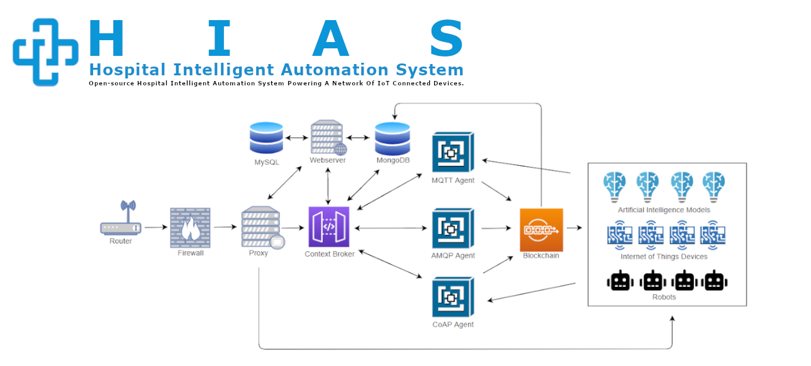
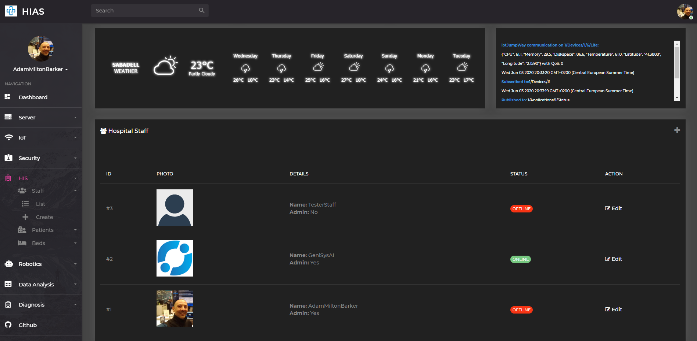
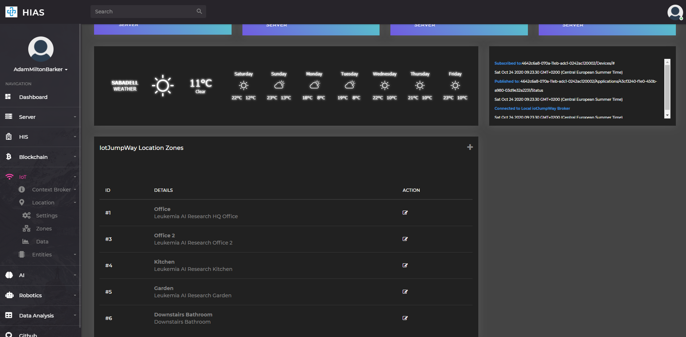
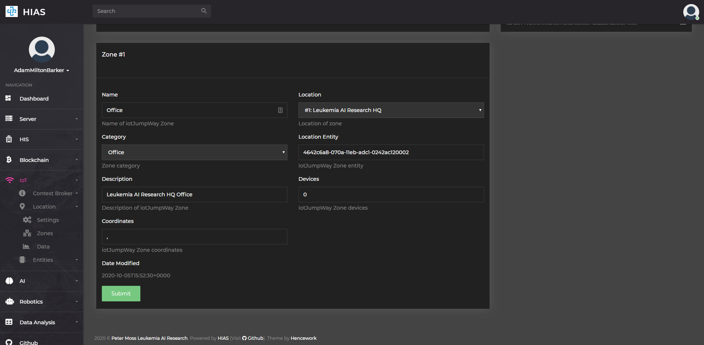
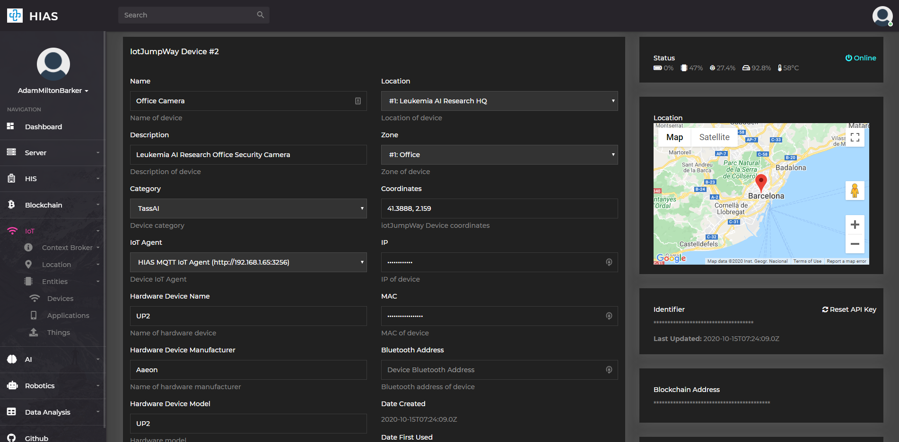
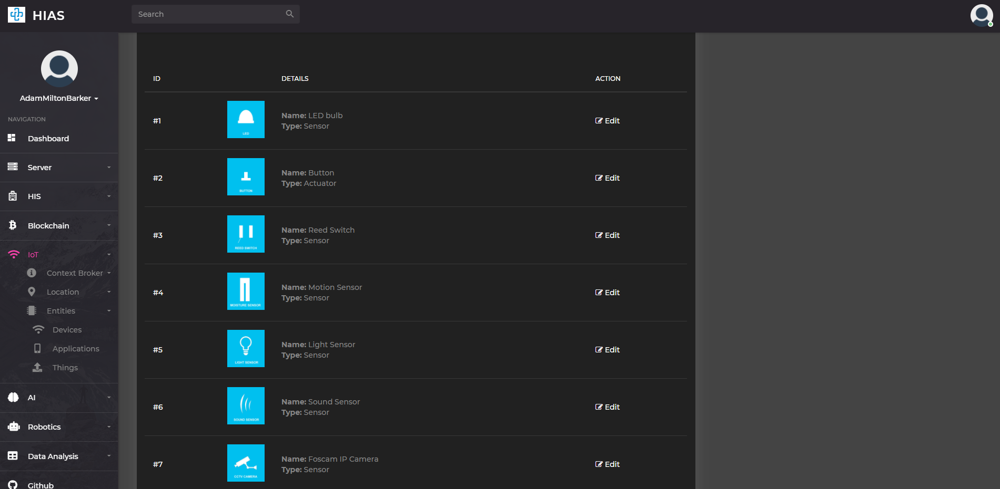
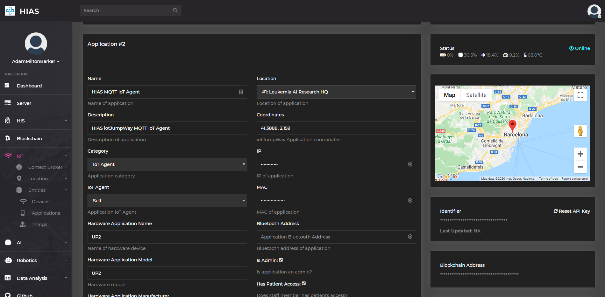
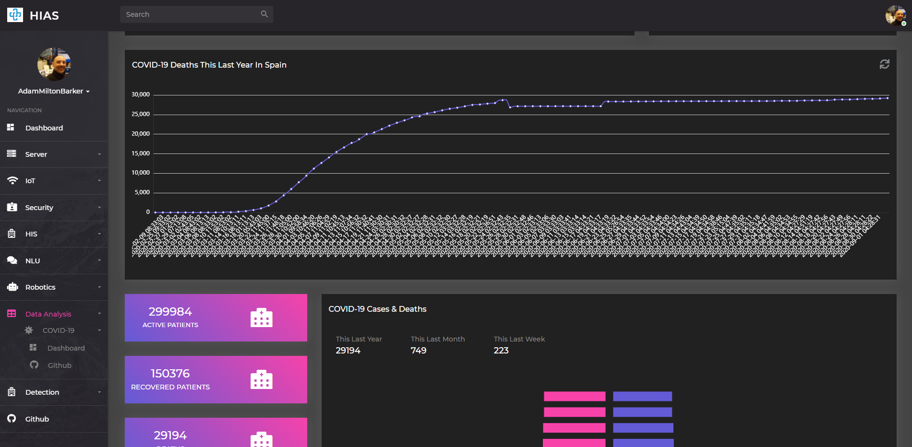
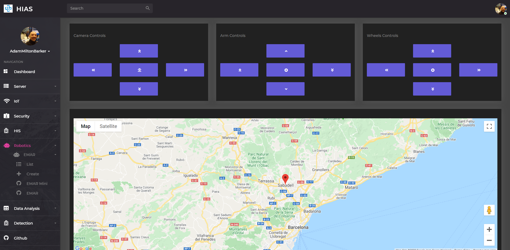

# Peter Moss Leukemia AI Research
## HIAS - Hospital Intelligent Automation System

     

&nbsp;

# Table Of Contents

- [Introduction](#introduction)
- [Key Features](#key-features)
- [HIAS Network Map](#hias-network-map)
- [HIAS UI](#hias-ui)
- [HIAS Users](#hias-users)
- [HIAS IoT Network](#hias-iot-network)
    - [HIAS IoT Network Zones](#hias-iot-network-zones)
    - [HIAS IoT Network Devices](#hias-iot-network-devices)
    - [HIAS IoT Network Sensors/Actuators](#hias-iot-network-sensors-actuators)
    - [HIAS IoT Network Applications](#hias-iot-network-applications)
    - [HIAS IoT Network Data](#hias-iot-network-data)
- [HIAS Facial Recognition](#hias-facial-recognition)
- [HIAS Data Analysis](#hias-data-analysis)
    - [COVID-19](#covid-19)
- [HIAS Diagnosis](#hias-diagnosis)
    - [COVID-19 Diagnosis (CNN)](#covid-19-diagnosis-cnn)
- [EMAR / EMAR Mini](#emar--emar-mini)
- [Installation](#installation)
- [Modular Addons](#modular-addons)
- [Acknowledgement](#acknowledgement)
- [Contributing](#contributing)
    - [Contributors](#contributors)
- [Versioning](#versioning)
- [License](#license)
- [Bugs/Issues](#bugs-issues)

&nbsp;

# Introduction

The **Peter Moss Leukemia AI Research HIAS Network** is an open-source Hospital Intelligent Automation System. The system's server powers an intelligent network using a locally hosted, encrypted IoT server and proxy. 

The server UI provides the capabalities of managing a network of open-soruce intelligent devices and applications. These devices/applications and databases all run and communicate on the local network. This means that premises have more control and security when it comes to their hardware, data and storage.   

__This project is a proof of concept, and is still a work in progress, however our plan is to work with a local medical/health center or hospital to do a pilot project.__

&nbsp;

# Key Features

- **Local Web Server (Complete)** 
    - Locally hosted webserver using NGINX.
- **Proxy (Complete)**
    - Secure access to local devices from the outside world.
- **High Grade SSL Encryption (Complete)** 
    - High grade (A+) encryption for the web server, proxy and network.
- **Server UI (Work In Progress)** 
    - A control panel to monitor and manage your HIAS network.
- **Local Samba Server (Complete)** 
    - A local Samba file server allowing controlled individual and group access to files on your local network.
- **Local IoT Broker (Complete)** 
    - Local and private MQTT/Websockets broker based on the  [iotJumpway Broker](https://github.com/iotJumpway/Broker "iotJumpway Broker").
- **Facial Identification Server (Complete)** 
    - Facial identification systems based on [tassAI](https://github.com/TASS-AI/Tass-History "tassAI").
- **Natural Language Understanding (NLU) Server (In Redevelopment)** 
    - Natural Language Understanding server based on [GeniSysAI](https://github.com/GeniSysAI/ "GeniSysAI").
- **HIS/HMS (In Development)** 
    - Hospital management system providing online tools for managing and running day to day activities and resources for the hospital.

&nbsp;

# HIAS Network Map
 

&nbsp;

# HIAS UI

The HIAS UI is the central control panel for the server, and all of the modular devices and applications that can be installed on it.

&nbsp;

# HIAS Users

HIAS users can be created using the HIS Staff system. Users can be granted admin privileges allowing them access to further restricted areas of the UI. Each user has a connected iotJumpWay application which will later be used in our HIAS Android application.

&nbsp;

# HIAS IoT Network

The HIAS IoT network is powered by a new, fully open-source version of the [iotJumpWay](https://www.iotJumpWay.com "iotJumpWay"). The HIAS iotJumpway dashboard is your control panel for managing all of your network iotJumpWay zones, devices, sensors/actuators and applications. 

The modular systems that we build to be compatible with this network will all create their own iotJumpWay applications etc during installation, you will be able to manage all of these applications and devices through the iotJumpWay dashboard. 

A HIAS network is represented by an iotJumpWay location. Within each location you can have multiple zones, devices and applications.

## IoT Network Zones

iotJumpWay Zones represent a room or area within a location. For instance, in a hospital you may have zones such as *Reception*, *Waiting Room*, *Operating Room 1* etc.

## IoT Network Devices

iotJumpWay Devices represent physical devices on the network. Each device is attached to a location and zone, allowing staff to know where each of their devices are, soon all devices will publish their location to the system allowing for real-time tracking within the network. 

## IoT Network Sensors/Actuators

iotJumpWay Sensors & Actuators represent physical sensors and actuators included on network devices and allows direct communication with each sensor/actuator. 

**This feature is still in development**

## IoT Network Applications

iotJumpWay Devices represent applications that can communicate with the  network. Each application is attached to a location, soon all applications will publish their location to the system allowing for real-time tracking.

 

## IoT Network Data

All data sent from devices and applications connected to the HIAS network is stored locally in a Mongo database (NoSQL). This means that staff can monitor all data on their network, and kall data stays on the network giving organizations total control of their data.

&nbsp;

# HIAS Facial Recognition

The HIAS facial recognition system is based on [tassAI](https://www.facebook.com/TASSNetwork/ "tassAI"). The facial recognition system uses cameras attached to devices on the network and processes frames from the cameras in real-time, before streaming the processed framed to a local server endpoint. Multiple TASS devices can be configured and there will soon be integration with popular IP cameras like Foscam etc. 

&nbsp; 

# HIAS Data Analysis

The HIAS network hosts a number of AI models that monitor data from local and external sources to make predictions based on the raw data. You can monitor real-time data using the HIAS UI. 

## HIAS COVID-19 Data Analysis

Functionality is now available to set up a basic COVID-19 tracker that will power the graphs in the HIAS UI. This system pulls data from the [COVID-19 Data Repository by the Center for Systems Science and Engineering (CSSE) at Johns Hopkins University](https://github.com/CSSEGISandData/COVID-19 "COVID-19 Data Repository by the Center for Systems Science and Engineering (CSSE) at Johns Hopkins University") and displays the stats in the UI. 

&nbsp;

# HIAS Diagnosis

Using AI models on the HIAS network, the UI can be used to classify image based samples for diseases such as COVID-19 and Leukemia. 

## HIAS COVID-19 Diagnosis (CNN)

 The HIAS COVID-19 Diagnosis (CNN) system uses the [COVID-19 Tensorflow DenseNet Classifier](https://github.com/COVID-19-AI-Research-Project/AI-Classification/tree/master/Projects/2 "COVID-19 Tensorflow DenseNet Classifier") project, a Tensorflow 2 DenseNet implementation using the [SARS-COV-2 Ct-Scan Dataset](https://www.kaggle.com/plameneduardo/sarscov2-ctscan-dataset "SARS-COV-2 Ct-Scan Dataset") by our collaborators, Plamenlancaster: [Professor Plamen Angelov](https://www.lancaster.ac.uk/lira/people/#d.en.397371) from [Lancaster University](https://www.lancaster.ac.uk/)/ Centre Director @ [Lira](https://www.lancaster.ac.uk/lira/), & his researcher, [Eduardo Soares PhD](https://www.lancaster.ac.uk/sci-tech/about-us/people/eduardo-almeida-soares).

&nbsp;

# EMAR / EMAR Mini
 

Functionality to update, monitor and control [EMAR](https://github.com/COVID-19-AI-Research-Project/EMAR "EMAR")/[EMAR Mini](https://github.com/COVID-19-AI-Research-Project/EMAR-Mini "EMAR Mini") is now available. These features allow you to create EMAR/EMAR Mini devices, update the settings, monitor the camera streams and send commands to the robotic arm to move it. 

 

 

&nbsp;

# Installation
Installation scripts and tutorials for setting up your HIAS - Hospital Intelligent Automation System & UI are provided. To get started, please follow the installation guides provided below in the order they are given:

| ORDER | GUIDE | INFORMATION | AUTHOR |
| ----- | ----- | ----------- | ------ |
| 1 | [Main Installation Guide](Documentation/Installation/Installation.md "Main Installation Guide") | Primary installation guide covering most of the information needed to do the core installation |  [Adam Milton-Barker](https://www.leukemiaresearchassociation.ai.com/team/adam-milton-barker "Adam Milton-Barker") |

&nbsp;

# Modular Addons
The HIAS network is made up of modular, intelligent devices. Below are some of the completed tutorials that can be used with the HIAS UI. Each project provides the details on how to connect them to the HIAS network, allowing them to controlled and monitored via the UI.

| GITHUB | README | INFORMATION | AUTHOR |
| ----- | ----- | ----------- | ------ |
| [COVID-19 AI Research Project](https://github.com/COVID-19-AI-Research-Project "COVID-19 AI Research Project") | [EMAR Mini](https://github.com/COVID-19-AI-Research-Project/EMAR-Mini "EMAR Mini") | EMAR Mini is a minature version of [EMAR](https://github.com/COVID-19-AI-Research-Project/EMAR "EMAR"), an open-source Emergency Robot Assistant to assist doctors, nurses and hospital staff during the COVID-19 pandemic, and similar situations we may face in the future. |  [Adam Milton-Barker](https://www.leukemiaresearchassociation.ai.com/team/adam-milton-barker "Adam Milton-Barker") |
| [COVID-19 AI Research Project](https://github.com/COVID-19-AI-Research-Project "COVID-19 AI Research Project") | [COVID-19 Tensorflow DenseNet Classifier](https://github.com/COVID-19-AI-Research-Project/AI-Classification/tree/master/Projects/2 "COVID-19 Tensorflow DenseNet Classifier") |  Uses DenseNet and [SARS-COV-2 Ct-Scan Dataset](https://www.kaggle.com/plameneduardo/sarscov2-ctscan-dataset "SARS-COV-2 Ct-Scan Dataset"), a large dataset of CT scans for SARS-CoV-2 (COVID-19) identification created by our collaborators, Plamenlancaster: [Professor Plamen Angelov](https://www.lancaster.ac.uk/lira/people/#d.en.397371) from [Lancaster University](https://www.lancaster.ac.uk/)/ Centre Director @ [Lira](https://www.lancaster.ac.uk/lira/), & his researcher, [Eduardo Soares PhD](https://www.lancaster.ac.uk/sci-tech/about-us/people/eduardo-almeida-soares) |  [Adam Milton-Barker](https://www.leukemiaresearchassociation.ai.com/team/adam-milton-barker "Adam Milton-Barker") |

&nbsp;

# Acknowledgement
The template used for the UI in this project is a commercial template by  [Hencework](https://hencework.com/ "Hencework"). We have been granted permission from Hencework to use their template in this project and would to thank them for doing so. Please check out their [Portfolio](https://themeforest.net/user/hencework/portfolio "Portfolio") for more examples of their work.

&nbsp;

# Contributing

The Peter Moss Acute Myeloid & Lymphoblastic Leukemia AI Research project encourages and welcomes code contributions, bug fixes and enhancements from the Github.

Please read the [CONTRIBUTING](CONTRIBUTING.md "CONTRIBUTING") document for a full guide to forking our repositories and submitting your pull requests. You will also find information about our code of conduct on this page.

## Contributors

- **AUTHOR:** [Adam Milton-Barker](https://www.leukemiaresearchassociation.ai.com/team/adam-milton-barker "Adam Milton-Barker") - [Peter Moss Leukemia AI Research](https://www.leukemiaresearchassociation.ai "Peter Moss Leukemia AI Research") Founder & Intel Software Innovator, Sabadell, Spain

&nbsp;

# Versioning

We use SemVer for versioning. For the versions available, see [Releases](releases "Releases").

&nbsp;

# License

This project is licensed under the **MIT License** - see the [LICENSE](LICENSE "LICENSE") file for details.

&nbsp;

# Bugs/Issues

We use the [repo issues](issues "repo issues") to track bugs and general requests related to using this project. See [CONTRIBUTING](CONTRIBUTING.md "CONTRIBUTING") for more info on how to submit bugs, feature requests and proposals.